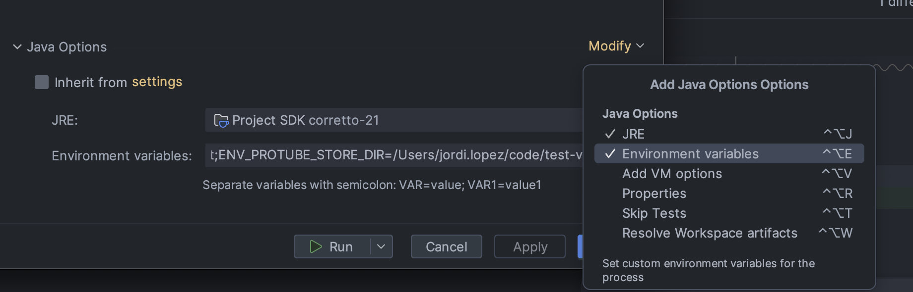
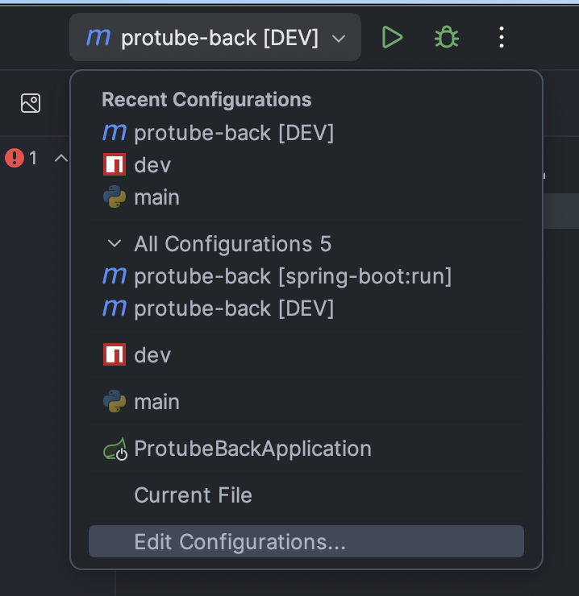
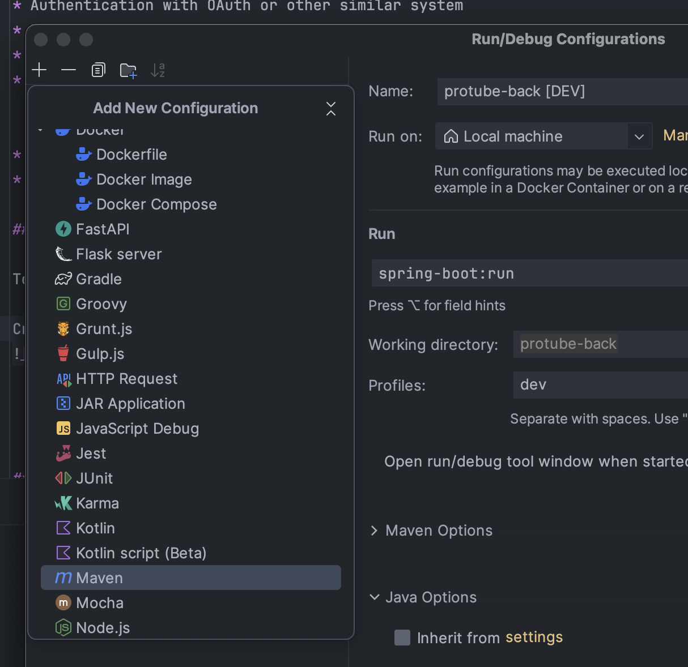
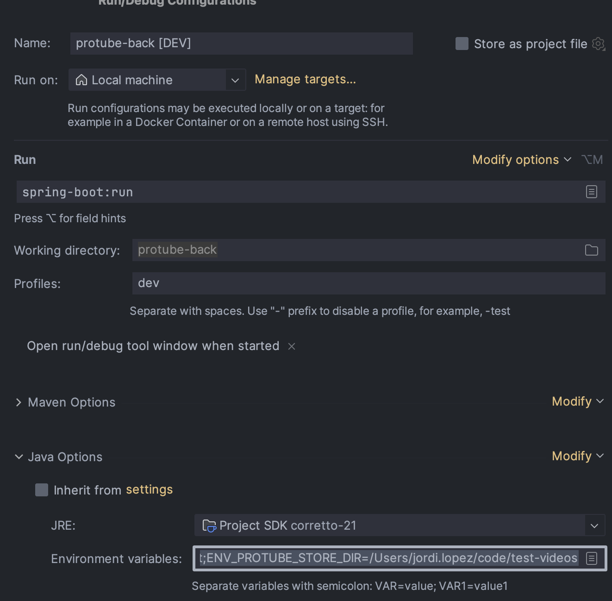

# Pro tube project


## Project

### Goals
The goal of this exercise is to reproduce as much as we can a REAL work environment. 
Creating a defined project from scratch using Agile methodologies to develop it.

### Teams
You have to create a groups of 3-4 people to develop the project. It depends on the team, but the main idea is to have at least one people in charge of the definition of the features.

###  MVP
The MVP consist in create a basic web with the following features:

* Authentication 
* View list of videos
* Play a video
* Video Upload
* Everything has to be well tested
* Comments has to be shown in every video 
* Registered users can add a comment 

### Improvements
Every team have to decide how the application has to be improved. We list a set of potential improvement.

* Authentication with OAuth or other similar system
* Rating videos
* Mobile/Responsiveness
* Searcher 
  * Using current DB
  * Using cached system such as Rabbit, Elastic
* Video metadata editor
* Documentation (Swagger, etc.)

## First steps
Before starting coding you have to be sure you have the following software already installed:
### Backend
* Java 21

### Frontend
* Node 20

### Database
* Docker or Postgres installed in the machine.

### Video grabber
* yt-dlp : [Instructions](https://github.com/yt-dlp/yt-dlp/wiki/Installation)
* ffmpeg
  * On Windows: Download the ffmpeg executable from FFmpeg’s official website. Extract the files and add the bin directory to your system’s PATH.
  * On macOS: Use Homebrew to install ffmpeg:
    ```commandline
    brew install ffmpeg
    ```
  * On Linux: Install ffmpeg using your package manager. For example, on Ubuntu:
    ```commandline
      sudo apt-get update
      sudo apt-get install ffmpeg
    ```
* Python 3x




## Backend
To run the backend, if you open the workspace you have to set the following configuration:

### Create dev config
* Open Configuration (from IDEA)
  * 
* Create a new Maven config
  * 
* Set configuration
  * 
* Set ENV variables
  * Be sure you have Environment Variables options
    
  ```
      ENV_PROTUBE_DB_PWD=secret;
      ENV_PROTUBE_DB=protube-dev;
      ENV_PROTUBE_DB_USER=root;
      ENV_PROTUBE_STORE_DIR=/Users/{user}/videos
  ```


### Dev mode


## Frontend

## Tooling

### Video grabber
This script here help you to generate a default content for the web.

Once you have resolved the dependencies explained above you can run the following command inside `tooling/videoGrabber` folder. 

```commandline
python3 main.py --store={Store_Folder} --id=10 --recreate
```
The command will generate 3 files per every video disposed in `tooling/videoGrabber/video_kist.txt`
* *.mp4: The video cutted
* *.webp: The thumbnail
* *.json: Metadata info about the video


## Set database

### Instruction using Docker

* Download docker image
  ```commandline
  docker pull postgres
  ```
* Create container
  ```commandline
  docker run --name postgres-dev -p 5432:5432/tcp -h 127.0.0.1 -e POSTGRES_USER=root -e POSTGRES_PASSWORD=secret -e PGDATA=/var/lib/postgresql/data/pgdata -e POSTGRES_INITDB_ARGS--auth-host=scram-sha-256 -v /Users/jordi.lopez/docker-postgres:/var/lib/postgresql/data -d postgres:latest
  ```
* Once you have created you can start it using
  ```commandline
  docker start postgres-dev
  ```
* Now let's install an Admin page
  ```commandline
  docker pull dpage/pgadmin4
  ```
* Set container for Postgres Admin
  ```commandline
  docker run -e PGADMIN_DEFAULT_EMAIL={YOUREMAIL} -e PGADMIN_DEFAULT_PASSWORD=test1234 -e PGADMIN_CONFIG_WTF_CSRF_ENABLED=False -p 8888:80 --name pgadmin4-dev dpage/pgadmin4
  ```
* Once you have created you can start it using
  ```commandline
  docker start dpage/pgadmin4
  ```
* Retrieve the Internal Ip
  ```commandline
  docker inspect pgadmin4-dev
  ```
  
  
